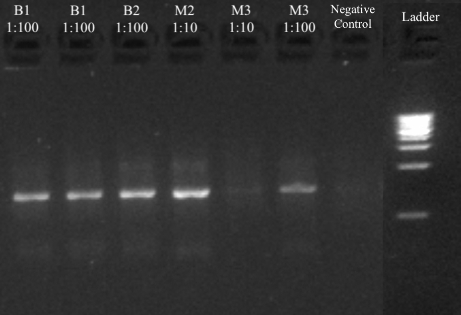
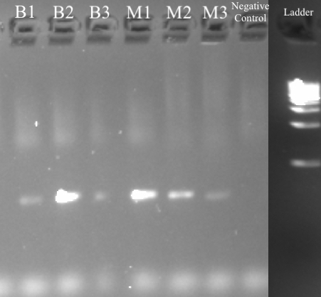
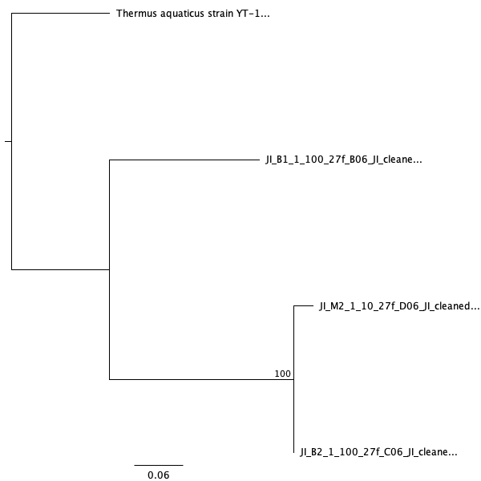
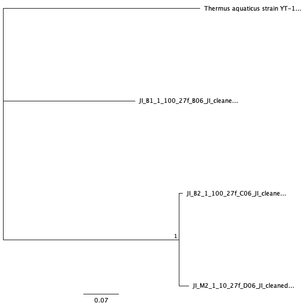

```{r setup, include = FALSE}
# global setup
knitr::opts_chunk$set(echo = FALSE, message = FALSE, warning = FALSE)
```

# Introduction

Bacterial microbes present in urban locations have been a major public health issue especially during the peak of the flu and cold seasons. These major concerns arise from the transfer of bacteria and harmful viruses, such as the influenza virus and adenovirus, from person to person in public locations such as parks, schools, hospitals, and especially public transportation in bustling cities, all of which contain abundant bacteria [@reynolds2005occurrence]. These bacteria may pose a threat to the health of individuals due to a high probability of the bacteria being pathogenic [@onat2017relationship]. According to numerous studies, some pathogens found in public transit include the *Staphylococcus* genus [@stepanovic2008public], most commonly found on human skin, and *S. aureus*, a pathogen responsible for giving rise to Methicillin-resistant *Staphylococcus aureus*, or MRSA [@otter2009bacterial]. MRSA is commonly known to cause mild infections on the skin, but some exposure may also be life-threatening, causing infections in the bloodstream, lungs, or urinary tract [@carleton2004community]. Therefore, due to this pressing public health concern, it is crucial to analyze the possibly dangerous strains of microbial communities present and growing in such locations.

The aim of my study is to shed light on the possible lack of cleanliness and maintenance done on public transportation in major cities such as San Francisco’s Bay Area Rapid Transit (BART) and Municipal Railway (Muni). San Francisco State University’s Biology Department has extracted microbial communities in micro-locations of public transportation harboring abundant and diverse bacteria. These locations included hand-touch surfaces, such as handrails and doors, seats and its material, and the floor of the transportation vehicle. In 2011, San Francisco State's biology researchers found fecal and skin-borne bacteria, mold, and MRSA bacteria on the fabric cushions of the BART seats. This contributed to the prompt replacement of the seats to new and supposedly cleaner vinyl coverings. Later in 2016, the same researchers re-tested the BART seats and found strains of *Pigmentiphaga*, a rare nonpathogenic bacteria found in waste water in South Korea and the South China Sea [@wang2013biodegradation]. The resulting conclusion from these two studies reveal the improvement of San Francisco's BART maintenance due to the new seat material. The overall findings of these particular studies also found that the majority of bacteria were located on the floor of public transportation vehicles [@yeh2011diversity]. Numerous other similar research around the world has been done in different cities such as London and Seoul, alternatively in order to investigate the culturable airborne bacterial and fungal communities in public transportation locations [@hwang2014comparison].

Similar to the studies previously mentioned, the purpose of my study was to examine and determine the types of bacterial communities harbored on the floor of the BART and Muni. Particularly, my first primary focal question for this study was “what kinds of bacteria contaminated these environments?” Additionally, I wanted to know how drastically the diversity and abundance of the bacteria differed between the two types of public transportation in the city area. Based on my two leading questions for my study, I hypothesized that *Staphylococci* and other less harmful pathogens would be present in both locations. This hypothesis is derived from both the lack of cleanliness from my personal experiences using BART and Muni, and previous findings from similar studies [@redman2013quality]. I also believe that the diversity will be larger in the Muni due to the lack of maintenance and very high volumes of diverse passengers on a day-to-day basis.

In order to test these hypotheses, I obtained 3 individual swab samples from each the Muni and BART floors. I performed both a culture and culture-free procedure for the two different treatments of each of the 3 samples. For the culture samples, the 6 samples in total were diluted 1, 1:10, and 1:100 respectively and the bacterial colonies were cultured on an agar dish. I extracted and amplified the DNA from the 6 most isolated colonies through PCR. Afterwards, I utilized gel electrophoresis in order to separate these DNA fragments according to the size and charge. Lastly, I used unidirectional Sanger sequencing, which allowed for the further analysis of the specific DNA composition [@ansorge2009next]. I compared the successful sequences with BLAST, which helped me determine what types of microbial strains and taxa were present within the colony samples and created a Maximum Likelihood Phylogeny and Bayesian Phylogeny [@griffen2011core].

In addition, to test the 6 culture-free samples, I utilized PCR to amplify the samples' sequences and to add a barcode for later Illumina sequencing. I then quantified the DNA concentrations with the use of Qubit and separated the products through gel electrophoresis. I then performed Illumina sequencing [@meyer2010illumina]. With the resulting Illumina data, I used sequence analysis methods with BASH scripts such as trimmometric to trim the sequences, bioawk to assess the quality, and BLAST to summarize the taxa of the results [@monger2017bioinformatics]. Furthermore, I created a DADA2 pipeline to create a amplification sequence variant table (ASV), an operational taxonomic unit (OTU) table, and a phylum table for all samples and the negative and positive controls [@callahan2016dada2].

The initial findings of this study from the culture samples revealed that the Muni appeared to contain more colonies after culturing and seemed to be more abundant overall. These abundant colonies from the Muni were also more diverse in morphotypes compared to the cultured BART samples. However, after running Sanger Sequencing and analyzing the Wilcox p-value, I found that neither the abundance nor morphotypes differed between the two public transportation locations and that the data between the two was not significantly different. According to the BLAST results of the molecular data, both BART 1 diluted to 1:10 and 1:100 possessed *Microbacterium phyllosphaerae* and *Microbacterium hydrocarbonoxydans* strains and BART 2 1:100 contained an *Acinetobacter schindleri* strain. Muni 2 1:10 also contained strains of *Acinetobacter sp.* and Muni 3 1:100 contained *Marinobacterium sp.* MB3 gene [@takeuchi1998union]. Out of all these BLAST results for the culture samples, *Acinetobacter schindleri* was the only bacterial strain to pose potential pathogenic risks [@nemec2001acinetobacter].

The findings from my culture-free Illumina sequencing samples showed that after running BLAST, sample M3 from the Muni treatment contained the most number and abundance of taxa, with 1095 different taxa in total. Sample B1 and B3 contained *Carnobacterium sp.* and B2 had *Acinetobacter schindleri*. For the Muni samples, M1 contained *Pantoea* bacterium, M2 had *Kosakonia cowanii*, and M3 possessed *Pantoea dispera*. Of these taxa BLAST results, the possible pathogenic taxa were *Acinetobacter schindleri*, *Kosakonia cowanii*, and *Pantoea dispera*. The overall prominent taxa found in the samples of the BART treatment is *Carnobacterium sp.*, where it is the major taxa in both B1 and B3. On the other hand, the main taxa from the samples in the Muni treatment is *Pantoea dispera*, where it is the major taxa found in M1 and M3 [@shokralla2015massively]. Along with the BLAST results for the Illumina samples, the DADA2 results revealed different phyla found in each sample, how many sequences were removed, any existing chimeras, and the total Amplicon Sequence Variants present in the products. According to the DADA2 results, the main phylum with the most number of sum abundances found in both BART and Muni was Proteobacteria and the top class was Gammaproteobacteria. Also, 87.56% of all samples were non-chimeric reads.

All in all, from both findings from the culture and culture-free results show that neither the abundance nor the diversity significantly differ between the two treatments, BART and Muni. Although neither contain *Staphylococci* or MRSA bacteria, both contain different types of surprising and unlikely strains of bacteria harboring the floor of the public transportation systems. According to the culture and culture-free BLAST results, some of the samples from both treatments contain potentially pathogenic strains of bacteria that may be a concern through a city-wide public health perspective.


# Methods

## Sampling

Materials required for the extraction of samples were 12 sterile 1.5mL tubes and swabs, gloves, zip block bags, and sterile phosphate-buffered saline (PBS). I collected all the samples on the same day. For the BART, I obtained the samples from the Richmond train from three different carts. I extracted the Muni samples from three difference buses on the 5R inbound route. I specifically obtained all samples from the entrances of all trains and buses, where foot-traffic should be the greatest. I took two swab samples from each specific location. For sample collection, I first dipped the sterile swab and moistened it into the sterile PBS before gathering the sample from the floor. I gently wiped the floor surface back and forth for approximately 10 seconds with one end of the swab. I placed the swab into its designated  tube, and broke off the long end of the swab in order to properly fit it in the tube. Each BART and Muni samples were labeled appropriately.

## Culture Samples
### Culturing and DNA Extraction

24 hours following the sample extraction, I diluted and cultured the samples. This culturing method required PBS, or buffer solution, 18 100mm TSA plates, and rattler beads. Before plating, all 6 samples were diluted 1:1, 1:10, and 1:100. I created the dilutions with the samples and designated amounts of PBS. In order to culture all 18 samples and and the dilutions, I pipetted 100μl of each sample onto the plate. I used 18 of the 100mm TSA plates for plating samples from each of my 2 treatments (n = 3 per group, 6 total). In order to spread the solution evenly throughout the surface of the plate, I used rattler beads. All 18 samples were then incubated at 37ºC for approximately 4 days before the analysis of colony abundance and morphotypes. Afterwards, I then recorded my observations based on the culture abundance counts and number of distinguishable morphotypes.
	
I extracted DNA from the cultures with the most isolated and abundant colonies. For this study, these 6 target colonies derived from B1 1:10, B1 1:100, B2 1:100, M2 1:10, M3 1:10, and M3 1:100. For DNA extraction, I followed the manufacturer’s protocol from the Sigma REDExtract-N-Amp kit [@weberextract]. Afterwards, I used Qubit to quantify the target colony DNA extractions [@haines2019detection]. The Qubit machine quantified each sample and I recorded the DNA concentrations in ng/μL.

### PCR Amplification and Gel Electrophoresis

During the following week, a PCR procedure was utilized in order to amplify the DNA extractions [@kuno1998universal]. Before beginning the protocol, I calculated the necessary volumes of reagents needed for the master mix using the formula (n+1) + 10%, where n=7. For one reaction, the volumes were 10μl Amp, 0.8μl 27f primer, 0.8μl 1492r primer, 1μl BSA, and 6.4μl H2O. I aliquoted 19μl of the master mix into all sample tubes and the negative control tube. Additionally, I pipetted 1μl of DNA extraction sample into its designated tube and 1μl H2O into the negative control. The PCR ran at 95º C for 5 minutes in order to denature and separate the long DNA strands. The temperature was then lowered to 94ºC for 30 seconds. Temperature was further lowered to 65ºC for 30 seconds, which is critical for annealing and for the primers to sit on the DNA. The temperature was increased again to 72ºC for 1 minute for extension and elongation by DNA polymerase. The temperature was raised to 95ºC for 30 seconds, 55ºC for 30 seconds, and 72ºC for 1 minute for a total of 25 cycles. Afterwards, the temperature was held at 72ºC for 10 minutes and held 4ºC. The touchdown PCR contained 2% agarose gel, SYBR safe dye, and TAE buffer. After the PCR image was taken, I recorded all observations based on the brightness or faintness of the band. Following the PCR, I ran the products on a gel electrophoresis gel at 140 volts for 30 minutes in order to separate the DNA fragments according to their size and charge [@aaij1972gel].

### Sanger Sequencing

After checking for successful amplification from PCR utilizing gel electrophoresis, I cleaned the PCR products using Invitrogen Exo-SAP (Exonuclease – Shrimp Alkaline Phosphatase). They were then sent for unidirectional Sanger sequencing at MCLAB located in South San Francisco, CA [@blazej2006microfabricated]. The Sanger sequencing results were finalized and sent back the following day for later analysis such as trimming and cleaning.

## Culture-Free Samples

### PCR and Gel Electrophoresis
For the culture-free samples, I began with PCR prep to amplify the DNA later for Illumina sequencing and analysis. For the PCR master mix, similar to the culture sample procedure, I calculated the necessary volumes of reagents needed using (n+1) + 10%, where n=7. The volumes for a single reaction reaction were 10μl Amp, 0.8μl iseq 16SF, 0.8μl iseq 16R, 1μl BSA, 6.4μl H2O, and 1μl of the DNA extraction. The negative control sample contained 1μl of H2O instead. The automated PCR cycles ran at 95ºC for 3 minutes, 95ºC for 30 more seconds, lowered to 55ºC for 30 seconds, 72ºC for an additional 30 seconds, and 72ºC for 5 minutes. Lastly, the PCR products were finally held at a temperature of 4ºC.  This process repeated cycles for a total of 25 cycles, allowing for amplification and the addition of a barcode for later Illumina sequencing. The touchdown PCR contained 2% agarose gel, SYBR safe dye, and TAE buffer. The image of the PCR bands were taken and I recorded observations based on the brightness and faintness of each band. Afterward, I utilized Qubit to quantify the data and recorded each of the DNA concentrations. I also performed gel electrophoresis on all samples in order to separate the samples according to size and charge. The gel ran at 140 volts for a total of 30 minutes for separation.

### Illumina Sequencing
Following electrophoresis, PCR products were purified using AmpureXP magnetic beads (Beckman-Coulter) and quantitated using a PicoGreen fluorescent assay (Invitrogen) on a Tecan Infinite M Plex plate reader. Purified PCR products were used as the template for a second round of PCR, which served to attach unique pairs of forward and reverse Illumina barcodes (Nextera XT Index 2 kit). All other components of the PCR mixtures were as for the first-round PCR. These reactions were cycled at 95 degrees C for 3 minutes, then 8 cycles of: 95 degrees C for 30 s, 55 degrees C for 30s, and 72 degrees C for 30s, followed by a 5 minute elongation cycle at 72 degrees C. Following this amplification, PCR products were purified and normalized with a SequelPrep normalization plate (Invitrogen), pooled, and then quantified once again with a Qubit 4 fluorometer (Invitrogen) and a TapeStation 4200 (Agilent) to verify library size and concentration. This library was then diluted to the loading concentration (50 pM) and combined with an Illumina PhiX spike-in library (5% spike in) and sequenced on an Illumina iSeq using a 2 x 150 bp consumable cartridge.


## Sequence and Statistical Analysis

In order to clean and trim the culture sequences, I used Geneious software for data analysis. The alignment program used is MAFFT, which is a fast and accurate multiple sequence alignment program in Geneious [@katoh2009multiple]. I first viewed all samples to determine which ones were successful and which can be cleaned and analyzed through BLAST. I then began the process of trimming the successful samples by taking out the beginning and ends of the sequence. I also cleaned the sequence data by using the IUPAC ambiguity codes to fixed those that contained mixed peaks. After cleaning and trimming the sequences, I used NCBI’s Nucleotide BLAST to determine what strains the colony contained [@johnson2008ncbi]. The alignment program used is MAFFT, which is a fast and accurate multiple sequence alignment program in Geneious [@katoh2009multiple]. All observations of the strains of each successful sample were recorded. Additionally, I created a Maximum Likelihood Phylogeny and Bayesian Phylogeny Tree. The two phylogeny programs used were MrBayes and PHYML. The relevant parameters for MrBayes included the substitution model set to GTR and the outgroup was a *Thermus aquaticus* strain. The MCMC settings were set as well. The chain length was 1,100,000, heated chains were 4, heated chain temperature was 0.2, subsampling freq was 200, burn-in length was 100,000, and random seed was 11,383. I kept the prior parameters in the default settings. The parameters for PHYML included the substitution model as GTR, branch support as Bootstrap, the number of bootstraps as 100, and the optimize was set as topology/length/rate. Additionally, I set the proportion of invariable sites as estimated as well as the gamma distribution parameter.

To analyze the sequences for the culture-free data, with the use of BASH scripts, I ran a quality assessment of the files using FastQC, a quality control tool for high throughput sequence data. I then used the Trimmomatic command line to trim, crop, and remove the Illumina (fastq) unusable sequences that could cause problematic issues downstream of analysis. Bioawk was then utilized to convert the fastq files to fasta. Afterwards, I carried out BLAST to determine the top taxa that match the sequences of each sample as well as the number of sequences that match with each given taxa.

### DADA2 Pipeline
A DADA2 pipeline in R was used on my Illumina data set in order to remove extra sequences, count the number of chimeras, count the total Amplicon Sequence Variants, and to determine the taxonomy of each sample [@callahan2016dada2]. Before beginning the pipeline, all necessary libraries were loaded. Some of the major libraries that were loaded for statistical analysis included dplyr, ggplot2, tidyr, knitr, dada2, and phyloseq. The first step of the pipeline was to begin visualizing the quality profiles of both the forward and reverse reads for each Illumina sample and negative controls. I then filtered and trimmed the newly named fastq.gz files. The error rates for each possible transition were plotted and shown. With the use of the error models, the forward and reverse reads were then merged together to obtain the full denoised sequences. From this, I constructed an Amplicon Sequence Variant table (ASV) and a operational taxonomic unit (OTU) table. I then identified chimeric sequences as well as its frequencies and then the chimeras were removed. I assigned taxonomy to all the sequence variants outside of R, which showed all the phyla, class, order, family, and genus. Lastly, I exported the cleaned, trimmed, filtered, and denoised sequence variants in order to build a phylogeny. From this, the metadata, and with the use of phyloseq, I created a phyloseq and melted phyloseq table for further generation of R-based results, the analysis of the microbiome data set, and the creation of box plots, charts, summary tables, and figures [@mcmurdie2013phyloseq]. 


# Results
## Culture Samples
Overall, to gather my culture sample results I cultured the bacterial colonies, extracted and quantified the DNA concentration with Qubit, ran PCR and gel electrophoresis, and sent the following products to MCLAB for Sanger Sequencing. From the resulting Sanger products, I cleaned and trimmed the sequences and aligned the sequences using MAFFT. Additionally, I created both a Bayesian Phylogeny and Maximum Likelihood Phylogeny along with statistical analysis methods through the calculation of the Wilcox p-values. From the Sanger sequencing products, I ran BLAST on all the successful samples after cleaning and trimming in order to determine the bacterial strains present within each sample, its percent identity, and query cover. All these methods and techniques allowed for the creation of the following figures and tables of the culture results. 

After quantifying DNA concentrations with Qubit, I found that DNA concentrations from BART significantly varied for the culture data, ranging approximately 5.92-34.1 ng/μl. However, concentrations from Muni were relatively consistent around 8.00-9.00 ng/μl (Table 1). These values for the DNA concentration revealed that DNA product was present within all samples for later analysis.

DNA product is present within most samples except for the negative control wells. Two separate images of the PCR bands from the culture and culture-free products show the presence of PCR product. According to the image of culture PCRs derived from the DNA extractions, the majority of the samples contain faint, but distinguishable, bands and approximately 200 to 300bp in reference to the ladder located in the far right lane (Figure 1). M3 1:10 is the only faint band and the rest of the bands are relatively normal-bright (Figure 1). All culture PCR products were sufficient for later Sanger Sequencing.

The mean values of the 10x dilution colonies were not significantly different between the two sites (p= 0.82, Figure 3). Because this, I fail to reject the null hypothesis, which states that the colony abundances between BART and Muni are the same and that there is no significant difference between the two locations (Figure 3). There was also no significant difference between the number of morphortypes (Wilcox p= 0.16, Figure 4). This indicates that I, again, fail to reject the null hypothesis which states that the morphotypes between the two treatments are the same and that there is no significant difference between the two morphotype results (Figure 4).

After Sanger sequencing, the samples’ sequences were cleaned and trimmed and afterwards aligned through Geneious's MAFFT alignment program. All samples’ loci were 16S. After analysis, B1 1:10, B1 1:100. B2 1:100, and M3 1:100 were determined usable and M2 1:10 and the negative control were not usable for the next step of BLAST analysis. This determination was based on the number of remaining sequences post cleaning, trimming, and alignment and what percentage of HQ% remained. The lengths of the sequences after trimming and cleaning, and the manual corrections made are also changed after alignment (Table 3).

The Maximum Likelihood Phylogeny shows the phylogeny of only the successful samples. M2 1:10 and B2 1:100 are more closely related than B1 1:100, as they are shown on the same clade. M2 1:10 and B2 1:100 are directly related, which is indicated by the bootstrap value which was 100 and the posterior probability value which was 0.06 (Figure 5). A Bayesian Phylogeny is also indicated between these same samples. The Bayesian Tree indicates similar results as the phylogeny. Again, the samples B2 1:100 and M2 1:10 are shown on the same clade and both are directly related to on another. The bootstrap value is 1 and the Bayesian posterior probability is 0.07 (Figure 6).

Lastly, the results of Nucleotide BLAST revealed which strains predominated within each sample colonies (Table 4). From this, I discovered that B1 1:10 contained *Macrobacterium phyllosphaerae* strain and its percent identity and query cover was 100%. B1 1:100 contained *Microbacterium hydrocarbonoxydans* strain with a percent identity of 99.87% and query cover of 99%, B2 1:100 had a *Acinetobacter schindleri* strain with its percent identity as 99.43% and query cover as 100%, M2 1:100 had a *Acinetobacter sp.* strain with percent identity 99.84% and query cover 99%, and lastly M3 1:100 contained a *Marinobacterium sp* MB3 gene with the percent identity of 76.74% and a query cover of 36%. Both M3 1:10 and the negative control were failed sequences, and therefore were not run and analyzed through BLAST (Table 4).


## Culture-free Samples

In order to obtain the results for the culture-free samples, I began with PCR in order to amplify the DNA of the 6 samples that were extracted from both treatments. Following PCR, I quantified the DNA concentrations of all samples to determine how much DNA product was present within the samples. Additionally, I performed gel electrophoresis at 140 volts for 30 minutes in order to separate the DNA according to size and charge. Lastly, for the methods, I performed Illumina sequencing on all PCR sample using Illumina iSeq. From the resulting Illumina products, I ran sequence and statistical analysis in order to analyze the data. I utilized FastQC to check the quality control of all samples, trimmed the sequences using BASH scripts and Trimmomatic, and ran BLAST in order to determine the resulting taxa and the number of sequences each taxa match. Additionally, I ran a DADA2 pipeline in R to remove extra sequences, count the number of chimeras, count the total Amplicon Sequence Variants, and to create another phylogeny for the samples.

The 6 samples' Qubit DNA concentrations varied among the culture-free samples, ranging from approximately 4.0-10.0 ng/μl. Despite this, though, all samples had enough DNA for further Illumina sequencing analysis. The lowest DNA concentration was exactly 4.90ng/μl and 4.44 ng/μl from sample B1 and the negative control respectively and the highest recorded concentration was 10.0 ng/μl from sample M1 (Table 2). All PCR products were also sufficient for later analysis. Within the culture-free samples, B1, B3, and M3 contained faint PCR bands. Samples B2, M1, and M2, however, possessed bright bands. The negative contained no band.The ladder indicated that all samples' PCR products were approximately 200bp (Figure 2).

After running FastQC Reports on all the 6 culture-free data, I was able analyze the sequence quality for all samples based on these reports. 0 sequences were flagged as poor quality in samples B1, B2, B3, M1, M2, and M3. Sample B1 contained 5014 sequences and 147-151 sequence length, B2 contained 7668 sequences and the same sequence length, B3 had 4990 sequences and the same sequence length, M1 had 7573 sequences and 51-151 sequence length, M2 had 10693 sequences and 43-151 sequence length, and lastly M3 had 14803 sequences and 43-151 sequence length.

After trimming with Trimmomatic, the number of sequences changed in all samples, increasing the accuracy of all the Illumina sequences. Overall, all the Illumina sequences were highly accurate and required little trimming. Only about 2% of each sample's sequences were dropped. For sample B1, the total original input reads were 5014 and 103 sequences were removed. 97.95% of B1's samples remained. For sample B2, 7668 original input reads were present and 168 sequences were dropped, resulting in 97.81% remaining. B3 contained 4990 input reads and 105 sequences were trimmed, resulting in 97.90% of sequences surviving. As for the Muni samples, M1 sample contained 7573 input reads and 148 sequences were dropped, with 98.05% remaining. Sample M2 had 10693 input reads, 238 dropped sequences, and 97.77% reads remaining. And lastly, M3 had 14803 input reads, 309 sequences were dropped, and 97.19% of the sequences remained after trimming (Table 5).

BLAST analysis of the culture-free samples allowed for the determination of exact taxa present within each sample and the number of sequences matching those given taxa (Table 6). The number of different taxa greatly varied among both treatments. For the BART samples, B1 contained 645 taxa and the major taxa with the highest number of sequences matched was *Carobacterium sp.*, B2 contained 236 different taxa and *Acinetobacter schindleri* was prominent, and B3 contained 550 different taxa and *Carnobacterium sp.* dominated as well. For the Muni treatment, M1 had 419 taxa with *Pantoea bacterium* as the major taxa, M2 contained 249 taxa with *Kosakonia cowanii* as the predominating taxa, and lastly M3 contained 1095 different taxa with *Pantoea dispersa* as the major taxa. From these results, M3 contained the most number of taxa with a total of 1095. Moreover, the prominent taxa in the overall BART treatment was *Carnobacterium sp.* and the major taxa in the Muni treatment was *Pantoea bacterium* (Table 6).

The DADA pipeline through R allowed for further metadata analysis of the Illumina sequencing products. The reads in for the sequences were 5014 for sample B1, 7668 for B2, 4990 for B3, 7573 for M1, 10693 for M2, and lastly 14803 for M3. The final sequence reads out for the same sequences were 5005, 7658, 4985, 7556, 10667, and 14774 respectively (Table 7). 16978723 total bases in 113586 reads from all 14 samples (Bart, Muni, and negative controls) were used for generating the error rates. From running the pipeline, 94 chimeras were identified out of the 687 input sequences. Therefore, 87.56% were non-chimeric reads. Additionally, the number of input sequences for sample B1 was 5014, B2 was 7668, B3 was 4990, M1 was 7573, M2 was 10693, and M3 was 14803 sequences. The number of filtered outputs were 5005, 7658, 4965, 7556, 10667, and 14774 respectively (Table 8). After filtering the sequences B1 had 5005, B2 had 7658, B3 had 4985, M1 had 7556, M2 had 10667, and M3 had 14774 sequences left. Following sequence filtering was denoising the sequences. This step left B1 with 4572, B2 with 7464, B3 had 4596, M1 had 7375, M2 had 10521, and M3 had 14062 sequences. Lastly, the non-chimeric reads for each sample were 4099 for B1, 6256 for B2, 3598 for B3, 6680 for M1, 10521 for M2, and lastly 12524 for M3.

The three phyla with the greatest number of sum abundance matching the sequences of all samples were phylum Proteobacteria, Firmicutes, and Actinobacteria (Figure 8). This indicates that the top three phyla seen in all samples are Proteobacteria, Firmicutes, and Actinobacteria. Proteobacteria had approximately 5500 sequences. Firmicutes had a sum abundance value of 2300. Lastly, Actinobacteria had a sum abundance of 1300 sequences. About 200 sequences were unidentifiable (Figure 7). More less major phyla found within my samples is Cyanobacteria, Chloroplast, and Bacteroidetes (Figure 8). Looking farther into the samples, the top classes for the BART samples are Gammaproteobacteria, Bacilli, Acintobacteria, Alphaproteobacteria, and Betaproteobacteria. Gammaproteobacteria contained about 45000 sequences matching, Bacilli had a value of about 23000 sum abundance, Acintobacteria had about 14000 sum abundance, Alphaproteobacteria had about 6000 sum abundance, and lastly Betaproteobacteria had about 4000 sum abundance. About 40000 sequences were unidentifiable (Figure 9).

The Shannon index reveals both the evenness of species present within my samples as well as its abundance. The alpha diversity measure was significantly higher than that of the BART samples, representative of more diversity microbial communities (Figure 9).

Lastly, the top and most prominent phylum seen amongst the BART samples is Proteobacteria, with the total sum abundance of 10397. Proteobacteria is also the most prominent phylum seen amongst the Muni samples as well, with a sum abundance of 25424 (Table 9). Taking a closer look, the top class with the highest sum abundance value amongst the BART samples was Gammaproteobacteria. This is similar with the Muni samples as well. BART treatment's sum abundance value was 9247 and the Muni treatment's sum abundance value was 19460 (Table 10). 


# Discussion

According to previous studies done in major cities such as San Francisco, London, and Seoul, many strains and forms of bacteria grow on the surface of the hand-touch surfaces, certain seat materials, and especially the floor of public transportation vehicles of public transportation locations, especially San Francisco’s commonly used BART and Muni. The two main leading questions I had going into this study were to first determine what kinds of bacterial strains contaminated the two environments and how did they compare. My second question was to determine whether or not the diversity or abundance greatly differed between the two treatments, BART and Muni. From these two leading questions and in reference to previous similar studies, I hypothesized that *Staphylococci* and other less harmful pathogenic bacteria would be found in both BART and Muni. I believed this would be occur because of my personal experience with riding the BART and Muni as well as the fact that *Staphylococci* is most commonly found on human skin and is known to be easy transferable between person to person and in the environment. Furthermore, to answer my second question, hypothesized that the diversity would be significantly greater in the Muni samples compared to Bart samples due to the lack of maintenance and cleanliness of the city buses as well as the high volume of people going through that specific form of transportation both on a daily basis and throughout the day.

Overall, some of my major results from my culture samples indicate that there is not a significant difference between the abundance data and morphotype data between the two treatments. Therefore, neither the abundance nor the morphotypes differ between BART and Muni. Additionally, from my Maximum Likelihood Phylogeny and Bayesian Phylogeny, I was able to conclude that the colonies from samples B2 1:100 and M 1:10 are directly related, which is indicated by the bootstrap value being 1 and that both phylogenies show that they share the same clade. Furthermore, the BLAST results for the culture samples indicated that most strains were nonpathogenic except for *Acinetobacter schindleri*, which pose some potentially pathogenic threats to human health.

An overview of my results for my culture-free samples show that from the BLAST results, out of the major taxa, *Acinetobacter schindleri*, *Kosakonia cowanii*, and *Pantoea dispera* is all possibly pathogenic strains. The most prominent taxa found in the samples of the BART treatment is *Carnobacterium sp.*, where it is the major taxa in both B1 and B3 samples. The main taxa from the samples in the Muni treatment is *Pantoea dispera*, where it is the major taxa found in M1 and M3. Also, sample M3 contained the most number of different taxa, with a value of 1095. After running the DADA pipeline, I found that the most prominent phyla for the culture-free samples were Proteobacteria, Firmicutes, and Actinobacteria. Additionally, notable phylum present within samples are also Cyanobacteria, Chloroplast, and Bacteriodetes. Furthermore, the most abundant classes observed were Gammaproteobacteria, Bacilli, Actinobacteria, and Alphaproteobacteria. The top phylum with the most sum abundance for both BART and Muni was Proteobacteria. This finding is similar to the top class found, which is Gammaproteobacteria, which is the same in BART and Muni.

According to my results of both the boxplots comparing the abundances and morphotypes between the two treatments separately and the Wilcox p-value calculations, I was able to conclude that the abundances and morphotypes did not vary significantly between treatments (Figure 3 and Figure 4). This is attributed to high median value of colony abundance in the Muni samples and the mean values not varying significantly. Therefore, I fail to reject the null hypothesis which states that both treatment abundances are similar (p=0.83, Figure 3). Moreover, I fail to reject the null hypothesis for the morphotypes, which states that the morphotypes between BART and Muni are the same. Although both the mean and median appear to vary greatly according to the boxplot, the p-value equaled 0.16 (Figure 4). None of the collected data between BART and Muni for abundance and morphotypes significantly differ. Therefore, overall, this answers my second question that asked how the abundance and morphotypes differ between the two public transportation systems. The culture results reveal that the bacterial communities growing on the BART and Muni floor surfaces do not greatly differ in abundance and diversity, rejecting the my initial hypothesis.

This conclusion that the abundance and morphotypes do not greatly differ between the two locations is supported with my culture-free results as well. This is indicated by the tables that show the top phylum and class with the highest value of sum abundance for the BART, Muni, and negative and positive controls (Table 9). According to these results, the top phylum found was Proteobacteria, which is very general gram-negative bacteria phylum that includes pathogenic strains. Observing through a closer lens, the class ended up being the same as well for both treatments (Table 10). The prominent class for the BART and Muni was Gammaproteobacteria, which is a class of medically, scientifically, and ecologically major groups of gram-negative bacteria.

Factors that may influence these findings may be that the same groups of people may be using both types of public transportation to arrive at their destination throughout the day. Another factor that may have affected these results is that the bacteria on the bottom of many individuals’ shoes do not make a major difference in the bacteria found on the public transportation floor because much of the bacteria picked up from the ground within the Bay Area are transferred equally to both locations and throughout the environment. Additionally, the maintenance of both the BART and Muni may be more similar than from what I predicted before beginning the study. Both maintenance may be done at night and be done extensively behind the scenes and away from the public view. Despite the apparent lack of cleanliness in the Muni, it is nearly equal in the BART as well. These factors may have caused the results found in the boxplots and may have led to the conclusion that the diversity and abundance of bacterial colonies in the BART and Muni do not differ greatly and are ultimately the same. These particular results align with much of the results found by other similar studies.
	
My additional leading question for this study addressed the contents of the bacteria on the floor and what specific strains existed in these locations. After cleaning, trimming, and aligning the Sanger Sequencing data and running it through the BLAST results, I discovered the top taxa in such locations. According to Table 4 of my results, I found that the majority of taxa were *Microbacterium* and *Acinetobacter* strains. Specifically, I found *Microbacterium phyllosphaerae*, *Microbacterium hydrocarbonoxydans*, *Acinetobacter schindleri*, *Acinetobacter sp.*, and *Marinobacterium sp.*. *Microbacterium phyllosphaerae* and *Microbacterium hydrocarbonoxydans* were interesting findings because both strains are derived from Germany. *Microbacterium phyllosphaerae* is found in grass from Germany and *Microbacterium hydrocarbonoxydans* is commonly isolated from oil found in soil from the same country. Additionally, these BLAST results were especially surprising because *Acinetobacter schindleri* is a potentially pathogenic strain of bacteria. The *Acintobacter* strains found are pathogens that are most notably responsible for infections and outbreaks found in the hospital setting and in intensive care unit (ICU) patients. *Acinetobacter schindleri* is still under extensive research with what symptoms it may cause in humans as a harmful pathogen, but this still causes much concern of possible pathogenic strains among my BLAST results [@montana2018first]. These taxa findings greatly differed from the findings of studies done in London, where researchers found *Staphylococcus aureus* harboring hand-touch surfaces in public transportation [@otter2009bacterial]. These findings also did not align with my initial hypothesis either, which stated that *Staphylococcus* would be present in both locations.

These BLAST results match with my phylogeny results seen through both the Maximum Likelihood Phylogeny and Bayesian Phylogeny (Figure 5 and Figure 6). Both phylogenies show that sample B2 1:100 and sample M2 1:10 are closely related, as they are show sharing the same clade. It is also known that they are very closely related due to the bootstrap value being 100 in the Maximum Likelihood Phylogeny (Figure 5) and 1 in the Bayesian Phylogeny (Figure 6). This agrees with the BLAST results as well, which indicated that sample M2 1:10's top taxa was *Acinetobacter sp.* strain and sample B2 1:100 was also a *Acintobacter schindleri* strain (Table 4). Additionally sample B1 1:100 is not closely related to neither of these samples indicated by both phylogenies because according to the BLAST results, B1 1:100 contained *Microbacterium hydrocarbonoxydans* as the top taxa. Therefore, with the support of the Maximum Likelihood and Bayesian Phylogeny, I am confident in my culture BLAST results.

I’m also confident in my culture samples' BLAST results that contained a percent identity of more than 90%, which is the number that describes how many characters in the sequence are identical. Therefore, I am confident in the BLAST results for B1 1:10, B1 1:100, B2 1:100, and M2 1:10, which contain 100%, 99.87%, 99.34%, and 99.84% percent identity values respectively. However sample M3 1:100 contained a percent identity value of only 76.74%, which is a concerning value and I therefore cannot be fully confident in this particular BLAST result.

I also ran BLAST on all 6 of my original culture-free samples. From these BLAST results, I found a wide variety of different taxa in my samples. These taxa included *Canobacterium sp.*, *Acinetobacter schindleri*, *Pantoea Bacterium*, *Kosakonia cowanii*, and *Pantoea dispersa*. *Canobacterium* is a gram-positive bacteria found in many food products and in the wild. It is not known to be a pathogenic bacteria in humans and does not raise any concern in my results. However, *Acinetobacter schindleri*, *Kosakonia cowanii*, and *Pantoea dispersa* are all pathogenic strains of bacteria and may potentially be harmful to humans. As mentioned with the culture BLAST results, *Acinetobacter schindleri* is a potentially pathogenic bacteria still under research, but is found to have caused outbreaks and infections in ICU patients. *Kosakonia cowanii* is a gram-negative pathogen that was originally isolated from blood from a patient. Although it is also commonly found in soil, plants, and infant formula, it contains genes that may be pathogenic [@yang2018complete]. Lastly, *Pantoea dispersa* is a virulent opportunist pathogen in a clinical setting, such as the ICU, and is harmful to compromised and immunosurpressed patients, especially young infants and elderly individuals [@panditrao2018pantoea].

For the culture-free samples, my BLAST results differed with my DADA2-based results. Unlike my BLAST results, the DADA2 taxonomy found mainly consisted of Gammaproteobacteria, Bacilli, Actinobacteria, and Alphaproteobacteria as the top classes, most of which are under the Proteobacteria phylum. The top class for both treatments with the largest sum abundance was Gammaproteobacteria. Of these results, Bacilli is the only class to be potentially pathogenic to humans. Bacillus is a rod-shaped disease causing bacterium, which contains a well-known pathogen, *Bacillus anthracis*, an anthrax causing pathogen [@helgason2000bacillus]. 

Factors that may influence the deviation from my taxa findings to previous studies such as the one done in London and Seoul as well as the recent studies done by SFSU on Bart seats may be due to the difference in culture and overall location. Specifically, London contains higher volumes of people all who possess different cultures, both locals and tourists, compared to San Francisco, where most people opt to take a car to travel rather than public transportation. Also the streets of London are less clean than the streets in the United States and are less maintained than the Bay Area. Lastly, the colder and more damp climate in the different places, such as London, may also play a leading role in the growth of certain bacterial strains and this difference in taxa results found. 

Additionally, some mistakes done throughout the experimental process may have caused some error. The sequence for M3 1:10 was unusable for both phylogeny and BLAST. This may be due to a mistake in pipetting or extraction of colony DNA, or also due to human error. It may also be because the colony was mixed with other neighboring colonies on the laboratory bench. Due to these possible factors, the sequence failed.

Next steps to carry my findings forward may be that I can begin by using a larger sample size to have enough results to confidently accept or deny my hypotheses. I would extract samples not only from the ground floor of the public transportation vehicles, but also the hand-touch surfaces, such as the railings, and the seat material. From this, I would be able to compare the different microbiome and how they compare to one another through abundance and morphotypes. This study can also be extended to other major cities with different cultural backgrounds, societies, and climate, which all may be leading factors that affect the different between bacterial strains in pubic locations.

Overall, this study revealed that both nonpathogenic and pathogenic bacterial communities grow on the floor public transportation in the San Francisco community. Luckily, however, none of the pathogens found included *Staphylococcus* strains or MRSA bacteria. This indicates the improvement of maintenance within the city’s public locations and also may reveal the future improvement of public health overall.

# Figures and Tables
```{r load-libraries}
# load libraries ggplot2, dplyr, tidyr, readr, broom, and knitr
library("ggplot2")
library("dplyr")
library("tidyr")
library("readr")
library("broom")
library("knitr")
library("dada2")
library("phyloseq")
library("mctoolsr")
library("seqinr")
library("citr")
library("lubridate")
library("forcats")
```


| Sample I.D. | Sample Group      | Sample Dilution I.D. | DNA Concentration (ng/μl) |
|-------------|-------------------|----------------------|---------------------------|
| B1          | BART              | 10                   | 34.1                      |
| B1          | BART              | 100                  | 11.5                      |
| B2          | BART              | 100                  | 5.92                      |
| M2          | Municipal Railway | 10                   | 8.27                      |
| M3          | Municipal Railway | 10                   | 8.33                      |
| M3          | Municipal Railway | 100                  | 8.37                      |
**Table 1:** Table of Qubit culture DNA concentration results. BART DNA concentrations significantly vary, however dsDNA concentrations were sufficient for PCR. The lowest DNA concentration recorded was 5.92ng/μl and the highest DNA concentration was 34.1ng/μl.

| Sample I.D.      | Sample Group      | DNA Concentration (ng/μl) |
|------------------|-------------------|---------------------------|
| B1               | BART              | 4.90                      |
| B2               | BART              | 8.48                      |
| B3               | BART              | 5.28                      |
| M1               | Municipal Railway | 10.0                      |
| M2               | Municipal Railway | 6.98                      |
| M3               | Municipal Railway | 5.94                      |
| Negative Control |                   | 4.44                      |
**Table 2:** Table of Qubit dsDNA concentration culture-free results measured in (ng/μl). Concentrations ranged between 4.44-10.0ng/μl among all samples. The highest DNA concentration was 10.0ng/μl observed in sample M1 and the lowest concentration was 4.44ng/μl, seen in the negative control.




**Figure 1:** Image of culture PCRs from the DNA colony extractions of 6 most abundant and isolated colonies. The ladder indicates that all the sequences were approximately 300bp. Samples B1 1:10, B1 1:100, B2 1:100, M2 1:10, and M3 1:100 contained bright bands, while sample M3 1:10 contained a faint band.



**Figure 2:** Image of culture-free PCRs from all 6 original extractions. The ladder is located on the right, indicating that sequences are approximately 200bp. Samples B2, M1, and M2 contain bright bands, while samples B1, B3, and M3 had faint bands.


```{r read-in-culture-data}
# read in the culture data from csv
culture_data <- read_csv(
  "data/raw_data/raw_culture_count_data/BIOL422_culturing_data.csv")
```

```{r filter-and-plot-abundances}
# filter out only my 100x dilutions and make a boxplot
culture_data %>%
  filter(student_name == "Jacqueline Imperial") %>%
  filter(dilution_1_10_or_100 == "10") %>%
  ggplot(aes(x = sample_group,
             y = number_of_colonies)) +
  geom_boxplot() +
  ggtitle("Comparison of Colony Abundances Between BART
          \nand Municipal Railway",
                "10x Dilution") +
  xlab("Sample Group") +
  ylab("Number of Colonies")
```

**Figure 3:** Boxplot of colony abundances at different sites, 10x dilution. Despite a higher median number of colonies from the Municipal Railway samples, the mean values of colonies were not significantly different between the two sites (Wilcox p = 0.82).

```{r abundances-stats}
# run a statistical test to compare the two groups of abundances
culture_data %>%
  filter(student_name == "Jacqueline Imperial") %>%
  filter(dilution_1_10_or_100 == "10") %>%
  wilcox.test(data = .,
              number_of_colonies ~ sample_group) %>%
  broom::glance(x = .) %>%
  knitr::kable()
```

```{r filter-and-plot-morphotypes}
# filter out only my 100x dilutions and make a boxplot
culture_data %>%
  filter(student_name == "Jacqueline Imperial") %>%
  filter(dilution_1_10_or_100 == "10") %>%
  ggplot(aes(x = sample_group,
             y = as.numeric(number_of_morphotypes))) +
  geom_boxplot() +
  ggtitle("Comparison of Morphotypes Between BART \nand Municipal Railway",
                "10x Dilution") +
  xlab("Sample Group") +
  ylab("Number of Morphotypes")
```

**Figure 4:** Boxplot showing the number of morphotypes from the two different sites. There was no significant difference in the mean number of morphotypes, W = 1 and p = 0.16.

```{r morphotypes-stats}
# run a statistical test to compare the two groups of abundances
culture_data %>%
  filter(student_name == "Jacqueline Imperial") %>%
  filter(dilution_1_10_or_100 == "10") %>%
  wilcox.test(data = .,
              as.numeric(number_of_morphotypes) ~ sample_group) %>%
  broom::glance(x = .) %>%
  knitr::kable()
```


| Sequence Locus | Original Filename       | Filename after Correction                       | Usability | Length After Trimming | Number of Manual Corrections |
|----------------|-------------------------|-------------------------------------------------|-----------|-----------------------|------------------------------|
| 16S            | JI_B1_1_10_27f_A06.ab1  | JI_B1_1_10_27f_A06_JI_cleaned_mixed.ab1         | Usable    | 280                   | 1                            |
| 16S            | JI_B1_1_100_27f_B06.ab1 | JI_B1_1_100_27f_B06_JI_cleaned.ab1              | Usable    | 771                   | 1                            |
| 16S            | JI_B2_1_100_27f_C06.ab1 | JI_B2_1_100_27f_C06_JI_cleaned.ab1              | Usable    | 609                   | 4                            |
| 16S            | JI_M2_1_10_27f_D06.ab1  | JI_M2_1_10_27f_D06_JI_cleaned.ab1               | Usable    | 633                   | 1                            |
| 16S            | JI_M3_1_10_27f_E06.ab1  | JI_M3_1_10_27f_E06_JI_failed.ab1                | Unusable  | 5                     | 0                            |
| 16S            | JI_M3_1_100_27f_F06.ab1 | JI_M3_1_100_27f_F06_JI_cleaned_failed_blast.ab1 | Usable    | 824                   | 3                            |
| 16S            | JI_neg_27f_G06.ab1      | JI_neg_27f_G06_JI_failed.ab1                    | Unusable  | 5                     | 0                            |

**Table 3:** Sequence analysis after cleaning and trimming culture samples using MAFFT alignment program in Geneious. Analysis indicates which samples were usable for BLAST results based on quality and sequence lengths after cleaning. Files B1 1:10, B1 1:100, B2 1:100, M2 1:10, and M3 1:100 were usable. Files M3 1:10 and negative control were unusable. 




**Figure 5:** Maximum Likelihood Phylogeny of the three most successful culture samples with the root being *Thermus aquaticus*. M2 1:10 and B2 1:100 are more closely related than B1 1:100, shown sharing the same clade and with a bootstrap value of 100.




**Figure 6:** A Bayesian Phylogeny of the most successful culture samples indicating that sample B2 1:100 and M2 1:10 are closely related sharing the same clade and with a bootstrap value=1. The Bayesian posterior probability is 0.07.


| Sample I.D.      | Description                                                                             | Percent Identity | Query Cover | E-Value | Accession  |
|------------------|-----------------------------------------------------------------------------------------|------------------|-------------|---------|------------|
| B1 1:10          | *Microbacterium phyllosphaerae* strain Y137 16S ribosomal RNA gene, partial sequence      | 100%             | 100%        | 6e-143  | MN477985.1 |
| B1 1:100         | *Microbacterium hydrocarbonoxydans* strain T11.3 16S ribosomal RNA gene, partial sequence | 99.87%           | 99%         | 0.0     | MN198007.1 |
| B2 1:100         | *Acinetobacter schindleri* strain H3 chromosome, complete genome                          | 99.34%           | 100%        | 0.0     | CP030754.1 |
| M2 1:10          | *Acinetobacter sp.* strain YX3 16S ribosomal RNA gene, partial sequence                   | 99.84%           | 99%         | 0.0     | MK138620.1 |
| M3 1:10          | Sequence Failed                                                                         |                  |             |         |            |
| M3 1:100         | *Marinobacterium sp.* MB3 gene for 16S rRNA, partial sequence                             | 76.74%           | 36%         | 2e-38   | AB490785.1 |
| Negative Control | Sequence Failed                                                                         |                  |             |         |            |
**Table 4:** A table of BLAST results from Sanger Sequence samples. The table indicates which strains are present in the bacterial colonies, along with the percent identity, query cover, and E-values. Sample B1 1:10 contained *Microbacterium phyllosphaerae*, B1 1:100 had *Microbacterium hydrocarbonoxydans*, B2 1:100 had *Acinetobacter schindleri*, sample M2 1:10 contained *Acinetobacter sp.*, and sample M3 1:100 had *Marinobacterium sp.*. Sample M3 1:10 was a failed sequence and was not analyzed through BLAST. 

| Sample I.D.           | Input Reads | Surviving | Surviving Percent | Dropped | Dropped Percent |
|-----------------------|-------------|-----------|-------------------|---------|-----------------|
| JI-B1_S31_L001_R1_001 | 5014        | 4991      | 97.95%            | 103     | 2.05%           |
| JI-B2_S32_L001_R1_001 | 7668        | 7500      | 97.81%            | 168     | 2.19%           |
| JI-B3_S33_L001_R1.001 | 4990        | 4885      | 97.90%            | 105     | 2.10%           |
| JI-M1_S34_L001_R1_001 | 7573        | 7425      | 98.05%            | 148     | 1.95%           |
| JI-M2_S35_L001_R1_001 | 10693       | 10455     | 97.77%            | 238     | 2.23%           |
| JI-M3_S36_L001_R1_001 | 14803       | 14494     | 97.91%            | 309     | 2.09%           |
**Table 5:** A table showing each culture-free sample after trimming through Trimmomatic. All samples contained at least 97% of its original sequence after trimming. About only 1.95-2.23% of the sequences were dropped for each sample.

| Sample I.D.           | Number of Different Taxa | Major Taxa               | Number of Sequences in Major Taxa |
|-----------------------|--------------------------|--------------------------|-----------------------------------|
| JI-B1_S31_L001_R1_001 | 645                      | *Carnobacterium sp.*       | 481                               |
| JI-B2_S32_L001_R1_001 | 236                      | *Acinetobacter schindleri* | 9084                              |
| JI-B3_S33_L001_R1_001 | 550                      | *Carnobacterium sp.*       | 542                               |
| JI-M1_S34_L001_R1_001 | 419                      | *Pantoea Bacterium*        | 1473                              |
| JI-M2_S35_L001_R1_001 | 249                      | *Kosakonia cowanii*        | 6028                              |
| JI-M3_S36_L001_R1_001 | 1095                     | *Pantoea dispersa*         | 10183                             |

**Table 6:** A table summarizing the major results from the command-line BLAST analysis of all 6 Illumina samples. For each sample, the number of taxa, major taxa, and number of sequences for each major taxa is given. Sample B1 contained *Carnobacterium sp.*, B2 had *Acinetobacter schindleri*, and B3 contained *Carnobacterium sp.*. For the Muni samples, M1 contained *Pantoea Bacterium*, M2 had *Kosakonia cowanii*, and sample M3 had *Pantoea dispersa*.

| Sample I.D.             | Reads In| Reads Out|
|:-----------------------------------|--------:|---------:|
|JI-B1_S31_L001_R1_001.fastq         |     5014|      5005|
|JI-B2_S32_L001_R1_001.fastq         |     7668|      7658|
|JI-B3_S33_L001_R1_001.fastq         |     4990|      4985|
|JI-M1_S34_L001_R1_001.fastq         |     7573|      7556|
|JI-M2_S35_L001_R1_001.fastq         |    10693|     10667|
|JI-M3_S36_L001_R1_001.fastq         |    14803|     14774|
**Table 7:** Table showing the reads in and reads out for the all samples' sequences after running through the DADA2 pipeline. 


|   Sample I.D        | Input| Filtered| Denoised| Sequence Table| Non-chimeric|
|:-----------------------------|-----:|--------:|--------:|--------------:|------------:|
|control-neg1_S79_L001_R1_001  | 10990|    10969|    10762|          10762|         8251|
|control-neg2_S80_L001_R1_001  |  3290|     3279|     3238|           3238|         2630|
|control-neg3_S81_L001_R1_001  | 13837|    13818|    13543|          13543|        10119|
|control-neg4_S82_L001_R1_001  |  7825|     7811|     7693|           7693|         6961|
|control-zymo1_S83_L001_R1_001 |  5236|     5233|     5129|           5129|         5021|
|control-zymo2_S84_L001_R1_001 |  4139|     4134|     4048|           4048|         3876|
|control-zymo3_S85_L001_R1_001 |  8448|     8426|     8305|           8305|         7824|
|control-zymo4_S86_L001_R1_001 |  9287|     9271|     9210|           9210|         8412|
|JI-B1_S31_L001_R1_001         |  5014|     5005|     4572|           4572|         4099|
|JI-B2_S32_L001_R1_001         |  7668|     7658|     7464|           7464|         6256|
|JI-B3_S33_L001_R1_001         |  4990|     4985|     4596|           4596|         3598|
|JI-M1_S34_L001_R1_001         |  7573|     7556|     7375|           7375|         6680|
|JI-M2_S35_L001_R1_001         | 10693|    10667|    10521|          10521|        10521|
|JI-M3_S36_L001_R1_001         | 14803|    14774|    14062|          14062|        12524|
**Table 8:** Indicated are the total number of sequences for all samples and the control groups. The values given in the table are the sequences remaining after filtering and denoising. It also indicates how many sequences are non-chimeric.


```{r load-phyloseq-data}
# load in the saved phyloseq object to work with
load("output/phyloseq_obj.Rda")

# melt phyloseq obj into a data frame for dplyr/ggplot
# analysis and visualization
melted_phyloseq <- psmelt(phyloseq_obj)

# turn all factor columns into character columns for dplyr
melted_phyloseq <- melted_phyloseq %>%
  mutate_if(is.factor, as.character)
```


```{r summary-table-phylum-sum-abundance}
# Create a summary chart of sequence results for each phylum and its abundance
melted_phyloseq %>%
  group_by(Phylum) %>%
  summarize(sum_abundance = sum(Abundance,
                                na.rm = TRUE)) %>%
  ggplot(aes(x = Phylum,
             y = sum_abundance)) +
  ggtitle("Phylum Abundance") +
  labs(y = "Sum Abundance") +
  geom_col() +
  theme(axis.text.x = element_text(angle = 45,
                                   hjust = 1,
                                   vjust = 1))
```

**Figure 7:** This figure is a summary chart of the culture-free BLAST sequence results showing each phylum and its sequence sum abundance values. Actinobacteria, Firmicutes, and Proteobacteria are the most abundant phylum strains present in the samples. Actinobacteria is ~1300, Firmicutes is ~ 2300, and Proteobacteria ~5500.


```{r bar-plot-taxa-abundance}
# bar plot of taxa and sample type
melted_phyloseq %>%
  group_by(type, Sample, Phylum) %>%
  summarize(sum_abund = sum(Abundance,
                            na.rm = TRUE)) %>%
  filter(sum_abund > 0) %>%
  ggplot(aes(x = type,
             y = sum_abund,
             fill = Phylum,
             color = Phylum,)) +
  theme(axis.text.x = element_text(angle = 90,
                                        hjust = 1)) +
    ggtitle("Phylum Sum Abundance") +
  labs(y = "Sum Abundance",
       x = "Type") +
  geom_col(position = position_fill())
```

**Figure 8:** The bar chart in this figure depicts sequence abundance of each taxa found for each of the sample data groups: BART, Muni, negative control, and positive control. BART samples contained mostly Proteobacteria and Firmicutes. Muni contained Proteobacteria and Actinobacteria. Negative control contained Firmicutes and Actinobacteria and the positive control does not contain any of the taxa, all indicated by the color on the bar chart.

```{r class-abundance-summary-table}
# a summary table of the class sum abundances
melted_phyloseq %>%
  group_by(Class) %>%
  summarize(sum_abundance = sum(Abundance,
                                na.rm = TRUE)) %>%
  ggplot(aes(x = Class,
             y = sum_abundance)) +
  ggtitle("Class Abundance") +
  labs(y = "Sum Abundance") +
  geom_col() +
  theme(axis.text.x = element_text(angle = 45,
                                   hjust = 1,
                                   vjust = 1))
```

**Figure 9:** A summary chart of the individual classes present in all samples and the sum abundance for each class. The top classes with the highest sum abundances were Gammaproteobacteria with ~46000, Bacilli with ~23000 sequences, Actinobacteria with 13000, and Alphaproteobacteria with ~6000. About 3000 sequences were unidentifiable.

```{r shannon-simpson-boxplot}
# Create a Shannon and Simpson diversity index boxplot
plot_richness(phyloseq_obj,
              x = "type",
              measures = c("Shannon"),
              title = "Diversity Index of Each Treatment")
```
**Figure 10:** The boxplot shows a Shannon diversity index of each sample type and the alpha diversity measure.

```{r type-phylum-summary-table}
# Create a table of sample type, main Phylum, and sum abundance of that phylum
melted_phyloseq %>%
  group_by(type, Phylum) %>%
  summarize(sum_abundance = sum(Abundance,
                                  na.rm = TRUE)) %>%
  top_n(1) %>%
  kable()
```

**Table 9:** A table show the top phyla in all sample types and the total sum abundance for that given phylum. Both BART and Muni's top phylum was Proteobacteria. 

```{r class-type-summary-table}
# create a summary table of each phylum and the count
melted_phyloseq %>%
  group_by(type, Class) %>%
  summarize(sum_abundance = sum(Abundance,
                                  na.rm = TRUE)) %>%
  top_n(1) %>%
  kable()
```

**Table 10:** A table indicating the top class and total sum abundance for all sample types. Bart and Muni contain the same top class, Gammaproteobacteria.


# Sources Cited
